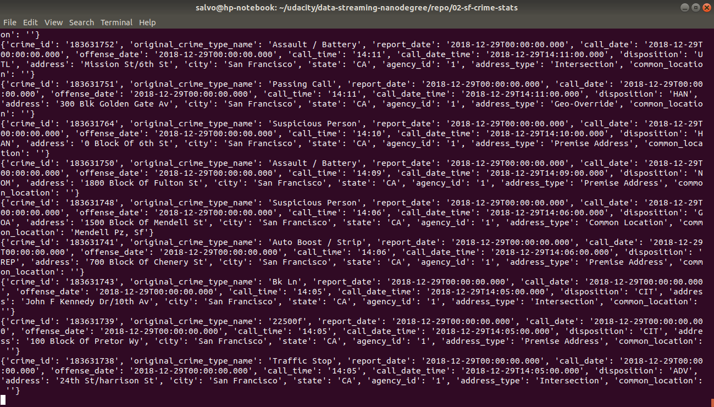
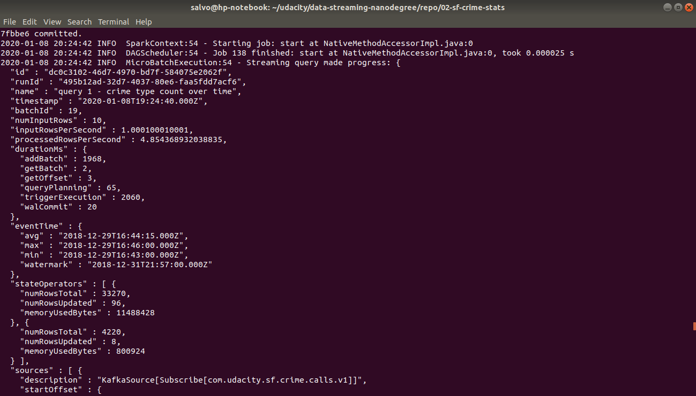
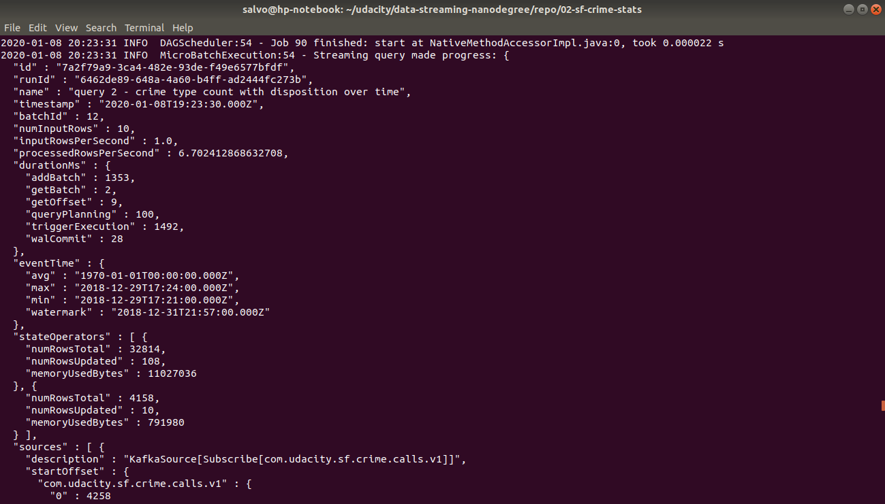
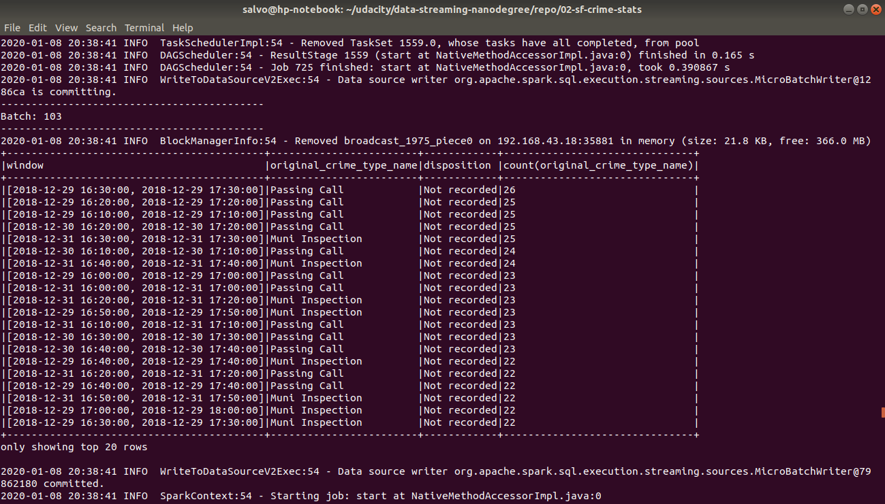
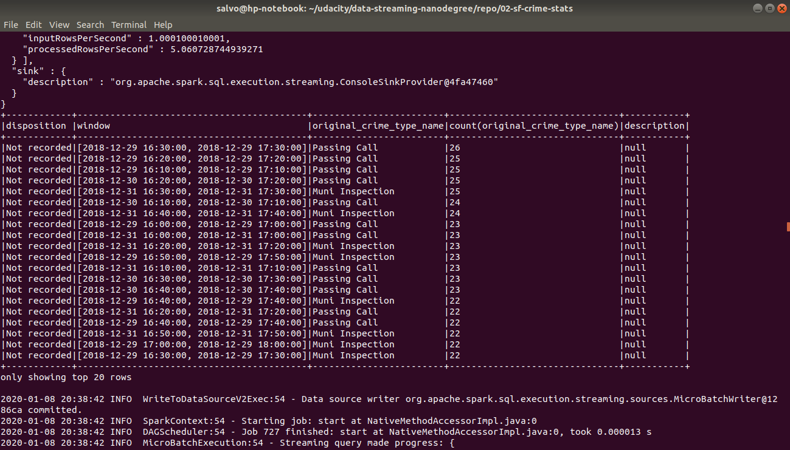

# San Francisco Crimes with Apache Spark Structured Streaming

In this project I use Apache Spark Structured Streaming to analyze crimes in the city of San Francisco.

## Prerequisites
* Apache Spark 2.4.3
* Scala 2.11.x
* Java 1.8.x
* Kafka build with Scala 2.11.x
* Python 3.6

## Setup

After downloading and installing the dependencies described above, first extract the data in the data/data.zip file and then run the following commands:

1. Start Zookeeper and Kafka
```
bin/zookeeper-server-start.sh config/zookeeper.properties
bin/kafka-server-start.sh config/server.properties
```

The `config` directory includes configuration files for both Zookeeper and Kafka.

2. Start the producer server which will read JSON data and write to a Kafka topic:
```
python kafka_server.py
```

3. Start the consumer server which will read JSON data from the Kafka topic and display it in the console:
```
python consumer_server.py
```

This consumer will provide output as show in the screenshot below.


4. Start Apache Spark Structured Streaming consumer:
```
spark-submit --packages org.apache.spark:spark-sql-kafka-0-10_2.11:2.3.4 --master local[*] data_stream.py
```

The `config` includes the configuration file for Spark.

The Spark consumer will write data produced by two queries to the console.

The progress report for both queries in shown below.





While tables with aggregated crime data are printed to the console as shown below.





## Questions

1. How did changing values on the SparkSession property parameters affect the throughput and latency of the data?

  Throughput and latency vary and we would like to have high throughput and low latency. Anyway, if latency grows too high throughput is affected, since the execution of the next batch is delayed until the current batch is processed by the query. As a result finding the right trade-off is not trivial. In order to achieve the best trade-off we can monitor the `processedRowsPerSecond` in the progress report.

2. What were the 2-3 most efficient SparkSession property key/value pairs? Through testing multiple variations on values, how can you tell these were the most optimal?

  When it comes to performance tuning, controlling the number of partitions is important to make sure that cluster resources are used efficiently. Keeping CPU cores busy will allow us to achieve high throughput and low latency. In general having too few partitions would result in underutilizing CPU cores available in the cluster, while having too many partitions will result in too much overhead in scheduling tasks. Ideally we would like to have all cores always busy and reduce the scheduling overhead as much as possible. To find the most optimal arrangement I have been trying different parameters looking for the combination providing the largest possible value for `processedRowsPerSecond`.

  To increase the value of `processedRowsPerSecond` we can play, at least, with the following settings:
  * `spark.default.parallelism`: the suggested value here is equal to the total number of cores on all executor nodes. For our specific use case, since we run the Spark consumer locally, the preferred setting is to set this equal to the number of cores on the local machine. This way each core will process data coming from a partition, and we will be using all cores in parallel maximizing throughput.

  * `spark.sql.shuffle.partitions`: this is the number of partitions to use when shuffling data for joins or aggregations. Together with `spark.default.parallelism` determines the parallelism when executing queries. Keeping the number of partitions equal to the number of available cores will result in reducing the overhead in scheduling tasks, since we will have a number of tasks exactly matching the number of cores. As a result, each task will execute on one core. Reducing the overhead in scheduling results in increased throughput and reduced latency.

  * `spark.streaming.kafka.maxRatePerPartition`: this is the maximum rate (number of records per second) at which data will be read from each Kafka partition. Putting a limit of the rate allows us to handle peak loads when reading data from the Kafka topic. Depending on the key used to write data to Kafka and on data skew, it might happen, indeed, that while reading a partition a consumer is overwhelmed with data.

  Notice, anyway, that latency, is also affected by the choice of triggers and watermarks in the pipeline, since materialization of the results in the sink (result table) will happen as a result of a trigger firing and of the watermark threshold being passed.
